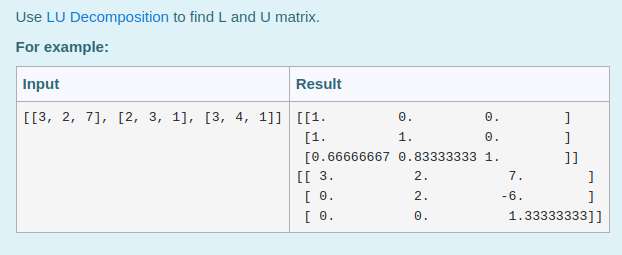
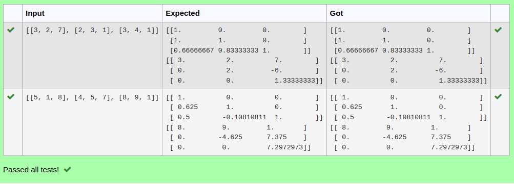
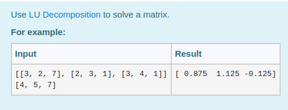
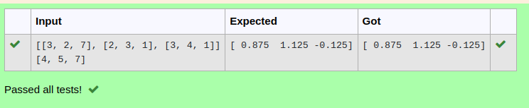

# LU Decomposition 

## AIM:
To write a program to find the LU Decomposition of a matrix.

## Equipments Required:
1. Hardware – PCs
2. Anaconda – Python 3.7 Installation / Moodle-Code Runner

## Algorithm
(i)
1. import numpy to perform array operations
2. from scipy.linalg import lu to find l,u .And then assign three variables to lu(A) then print l,u
##
(ii)
##
1. import numpy to perform array operations
2. from scipy.linalg import lu_factor,lu_solve. And then assign one variable to lu_factor(A) ,other variable to lu_solve(first_variable,B)
  then print second variable

## Program:
(i) To find the L and U matrix
```
/*
Program to find the L and U matrix.
Developed by:Shaik Shoaib Nawaz
RegisterNumber:22005600
*/import numpy as np #from numpy import array
from scipy.linalg import lu
arr=eval(input())
A=np.array(arr)
P,L,U=lu(A)
print(L)
print(U)
```
(ii) To find the LU Decomposition of a matrix
```
/*
Program to find the LU Decomposition of a matrix.
Developed by:Shaik Shoaib Nawaz
RegisterNumber:22005600
*/
import numpy as np
from scipy.linalg import lu_factor,lu_solve
A=np.array(eval(input()))
B=eval(input())
res=lu_factor(A)
solution=lu_solve(res,B)
print(solution)
```

## Output:
### Question1:

### Output1:

### Question2:

### Output2:



## Result:
Thus the program to find the LU Decomposition of a matrix is written and verified using python programming.

